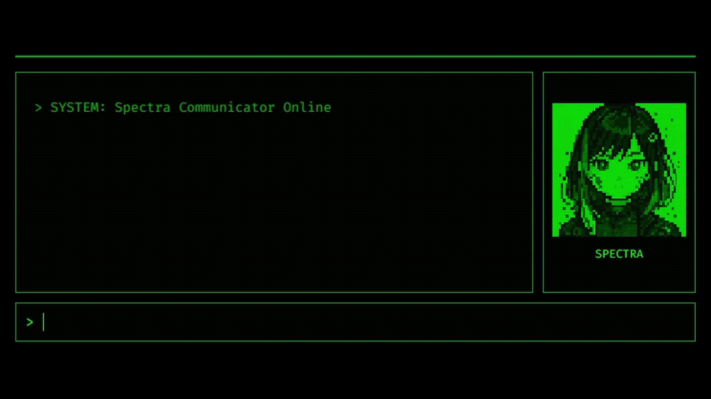
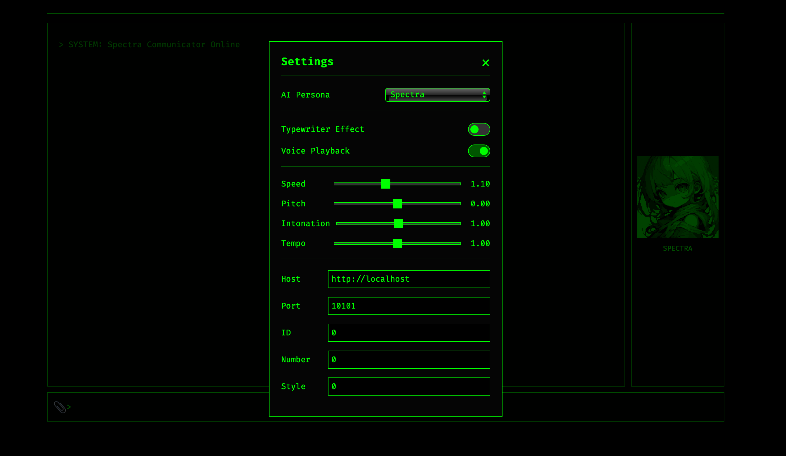

# Avatar UI Core

クラシックなターミナル調のUIコア。チャットUIからCLI統合まで拡張可能なプロジェクト基盤を提供します。


[](https://github.com/psf/black)



## 特徴

- **ターミナルUI** - グリーンオンブラックの古典的ターミナルインターフェース
- **AIアバター** - 発話同期型のピクセルアートアバター表示（ペルソナごとに設定可能）
- **タイプライター効果** - 文字単位のリアルタイム表示アニメーション（ON/OFF切り替え可能）
- **サウンドエフェクト** - Web Audio APIによるタイピング音生成
- **音声合成** - AIの応答を音声で再生（ON/OFF切り替え可能、vsayオプション調整可能）
- **画像アップロード** - チャットに画像を添付してAIに送信可能（ドラッグ＆ドロップ対応）
- **AIペルソナ管理** - 複数のAIペルソナを切り替え可能（アバター、プロンプト、音声設定をペルソナごとに保存）
- **設定の永続化** - 最後に使用したペルソナやUI設定をブラウザに保存
- **画像入力対応**（Ollamaのみ） - マルチモーダル対応のモデルの場合は画像を読み込むことが可能

## 基本操作

1. **メッセージ送信**: 画面下部の入力欄にテキストを入力してEnterキー
2. **会話履歴**: 自動的にスクロールされる会話履歴を確認
3. **アバター**: AIの応答中はアバターが応答アニメーション
4. **設定変更**: アバター画像をクリックすると設定モーダルが開き、各種設定を変更できます。

## クイックスタート

### 必要要件

- Python 3.8以上
- Google AI Studio APIキー（[取得はこちら](https://aistudio.google.com/app/apikey)）
- vsay: 音声合成に使用します。`./bin/vsay`として配置し、実行権限を付与してください。[こちら](https://github.com/Dotinkasra/vsay)からインストールできます。
- [AivisSpeach](https://aivis-project.com/) または [VOICEVOX](https://voicevox.hiroshiba.jp/) の engine（音声合成を使用する場合）

### インストール手順

#### 1. プロジェクトの取得

```bash
# リポジトリのクローン（またはZIPダウンロード後に解凍）
git clone https://github.com/yourusername/avatar-ui-core.git
cd avatar-ui-core
```

#### 2. Python仮想環境の作成

仮想環境を使用することで、システムのPython環境を汚さずにプロジェクトを実行できます。

```bash
# 仮想環境の作成
python -m venv venv

# 仮想環境の有効化
# Linux/Mac:
source venv/bin/activate
# Windows (コマンドプロンプト):
venv\Scripts\activate
# Windows (PowerShell):
venv\Scripts\Activate.ps1
```

仮想環境が有効化されると、ターミナルのプロンプトに`(venv)`が表示されます。

#### 3. 必要なパッケージのインストール

```bash
# requirements.txtに記載されたパッケージを一括インストール
pip install -r requirements.txt
```

### 設定

#### 1. 環境変数ファイルの準備

```bash
# テンプレートファイルをコピーして.envファイルを作成
cp .env.example .env
# Windows: copy .env.example .env
```

#### 2. 環境変数の設定
テキストエディタで`.env`ファイルを開き、必須項目を設定

##### 共通
**外部にサーバーを公開したい場合は以下のように項目を変更してください。**

```bash
# サーバーアドレス
SERVER_HOST=0.0.0.0
# デバッグモード（開発時: True, 本番: False）
DEBUG_MODE=False
```

##### AIプロバイダーの選択
`AI_PROVIDER`で`gemini`または`ollama`を選択します。

###### Google Geminiを使用する場合

```bash
AI_PROVIDER=gemini
GEMINI_API_KEY=ここに取得したAPIキーを貼り付け
MODEL_NAME=gemini-1.5-flash-latest  # または gemini-1.5-pro-latest など
```

###### Ollamaを使用する場合

```bash
AI_PROVIDER=ollama
OLLAMA_HOST=ollamaをホストしているマシンのIPアドレス（例: http://localhost:11434 または http://host.docker.internal:11434 (Docker利用時)）
MODEL_NAME=llama3:latest # その他インストール済みのモデル名
```

#### 3. AIペルソナ設定

AIの性格、アバター画像、音声設定は`prompt_settings/`ディレクトリ内のJSONファイルで管理されます。  
ペルソナごとのJSONファイルを作成することで複数のペルソナを管理可能です。

- `prompt_settings/Spectra.json`: デフォルトのペルソナ設定

これらのファイルを直接編集するか、アプリケーションのUIから設定モーダルを開いて変更できます。

**重要**: `.env`ファイルには機密情報が含まれるため、絶対にGitにコミットしないでください。

### 起動

```bash
# アプリケーションの起動
python app.py
```

起動に成功すると以下のようなメッセージが表示されます：
```
 * Running on http://127.0.0.1:5000
```

ブラウザで `http://localhost:5000` にアクセスしてください。

## プロジェクト構造

```
avatar-ui-core/
├── app.py                  # Flaskアプリケーション本体
├── settings.py             # 設定管理モジュール
├── requirements.txt        # Python依存関係
├── .env.example           # 環境変数テンプレート
├── prompt_settings/       # AIペルソナ設定ファイル
│   ├── Spectra.json
├── static/
│   ├── css/
│   │   └── style.css      # UIスタイル定義
│   ├── js/
│   │   ├── app.js         # メインエントリーポイント
│   │   ├── chat.js        # チャット機能
│   │   ├── animation.js   # アニメーション制御
│   │   ├── sound.js       # 音響効果
│   │   └── settings.js    # フロントエンド設定
│   ├── images/
│   │   ├── idle.png       # アバター（静止）
│   │   └── talk.png       # アバター（発話）
│   └── audio/             # 生成された音声ファイル
└── templates/
    └── index.html         # HTMLテンプレート
```

**注意**: `docs/`フォルダには開発時のメモやアセットが含まれており、アプリケーション動作には影響しません。

## カスタマイズ方法

ほとんどの設定はUIから変更可能です。  



### 1. AIペルソナのカスタマイズ

`prompt_settings/`ディレクトリ内のJSONファイルを編集するか、アプリケーションのUI（アバター画像クリックで開く設定モーダル）から「AI Persona」を選択し、各種設定を調整してください。

- `avatarName`: AIアシスタントの名前
- `avatarFullName`: AIアシスタントのフルネーム
- `systemInstruction`: AIの人格や応答スタイルを定義するプロンプト
- `avatarImageIdle`: 静止時のアバター画像ファイル名（`static/images/`からの相対パス）
- `avatarImageTalk`: 発話時のアバター画像ファイル名（`static/images/`からの相対パス）
- `vsayOptions`: 音声合成コマンド`vsay`のオプション（Speed, Pitchなど）

```json
//prompt_settings/persona-name.json
{
  "avatarName": "ペルソナの名前",
  "avatarFullName": "チャットの一番上に出てくるメッセージ",
  "systemInstruction": "システムプロンプト",
  "avatarImageIdle": "口を閉じてる画像の名前",
  "avatarImageTalk": "口を開いている画像の名前",
  "vsayOptions": {
    "host": "http://localhost", //AivisSpeachまたはVOICEVOXのengineが起動しているホストのアドレス
    "port": 10101, //ポート番号
    "id": 0, //スタイルID（"number"と"style"が設定されている場合は不要）
    "number": 0, //話者ID（"id"が設定されている場合は不要)
    "style": 0, //vsay lsで表示されるスタイルID（"id"が設定されている場合は不要)
    "intonation": 1.0, 
    "pitch": 0.0,
    "speed": 1.1,
    "tempo": 1.0
  }
}

```

### 2. タイプライター音のON/OFF

アプリケーションのUI（アバター画像クリックで開く設定モーダル）から「Typewriter Effect」のON/OFFを切り替えられます。

### 3. ボイス再生のON/OFF

アプリケーションのUI（アバター画像クリックで開く設定モーダル）から「Voice Playback」のON/OFFを切り替えられます。

### 4. vsayオプションの調整

アプリケーションのUI（アバター画像クリックで開く設定モーダル）から「Speed」「Pitch」などのスライダーやテキスト入力で`vsay`コマンドのオプションを調整できます。設定は現在のペルソナに保存されます。

### 5. その他の設定

`settings.py`で以下の項目を編集：

- `TYPEWRITER_DELAY_MS`: タイプライター効果の速度（ミリ秒、小さいほど高速）
- `MOUTH_ANIMATION_INTERVAL_MS`: 口パクアニメーション間隔（ミリ秒）
- `BEEP_FREQUENCY_HZ`: ビープ音の周波数（Hz）
- `BEEP_VOLUME`: ビープ音の音量（0.0-1.0）
- `BEEP_DURATION_MS`: ビープ音の長さ（ミリ秒）
- `BEEP_VOLUME_END`: ビープ音終了時の音量

**注意**: `settings.py`の変更後はアプリケーションの再起動が必要です。

## 環境変数一覧

| 変数名 | 説明 | デフォルト値 | 必須 |
|--------|------|-------------|------|
| `AI_PROVIDER` | 使用するAIプロバイダー (`gemini` または `ollama`) | `gemini` | ✅ |
| `GEMINI_API_KEY` | Google Gemini APIキー | - | `AI_PROVIDER`が`gemini`の場合 |
| `OLLAMA_HOST` | OllamaサーバーのホストURL | - | `AI_PROVIDER`が`ollama`の場合 | 
| `MODEL_NAME` | 使用するAIモデル名 | `gemini-1.5-flash-latest` または `llama3:latest` | ✅ |
| `SERVER_HOST` | サーバーアドレス | `127.0.0.1` | |
| `SERVER_PORT` | サーバーポート番号 | `5000` | |
| `DEBUG_MODE` | デバッグモード有効化 | `True` | |
| `FLASK_SECRET_KEY` | Flaskセッションの秘密鍵 | ランダム生成 | |

**注意**: `AVATAR_NAME`、`SYSTEM_INSTRUCTION`などのAI関連設定は、`prompt_settings/`ディレクトリ内のペルソナJSONファイルで管理されるようになりました。

## 技術スタック

### バックエンド
- **Flask 3.0.0** - Webアプリケーションフレームワーク
- **google-generativeai 0.8.3** - Gemini API統合
- **ollama** - OllamaローカルAIモデル統合
- **python-dotenv 1.0.0** - 環境変数管理

### フロントエンド
- **ES6 Modules** - モジュール化されたJavaScript
- **Web Audio API** - ブラウザネイティブ音響生成
- **CSS3** - モダンなスタイリング
- **Fira Code** - プログラミング用等幅フォント

## ⚠️ 注意事項

- 本プロジェクトはネイキッド版UI基盤として提供されており、デフォルト実装は単一ユーザー利用を前提としています。
- APIキーなどの秘密情報は `.env` に保存され、サーバー内でのみ利用されます。
- **vsayコマンドの実行権限**: `vsay`コマンドには実行権限が必要です。`chmod +x ./bin/vsay`で権限を付与してください。
- **生成される音声ファイル**: `static/audio/`ディレクトリに一時的な音声ファイルが生成されます。これらのファイルは、次のチャットリクエスト時、またはアプリケーション起動時に自動的に削除されます。
- 個人利用・学習用途ではそのままご利用いただけますが、不特定多数に公開する場合は
  - ユーザーごとの設定保存
  - 認証機構の追加
  
  が必須となります。

## ライセンス

MIT License - 詳細は[LICENSE](LICENSE)ファイルを参照

## クレジット

Developed by Sito Sikino

### 使用技術
- Google Gemini API
- Flask Framework  
- Fira Code Font

---

**注意**: このプロジェクトはエンタメ・創作目的で作成されています。本番環境での使用時は適切なセキュリティ対策を実施してください。