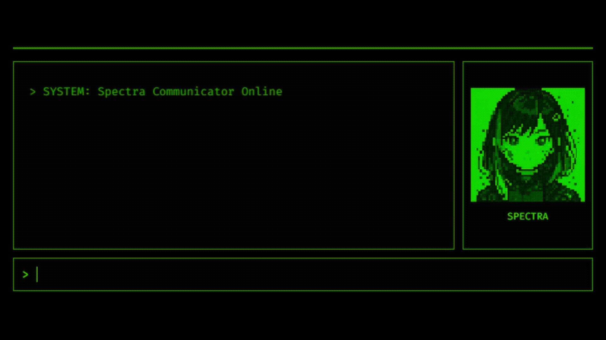
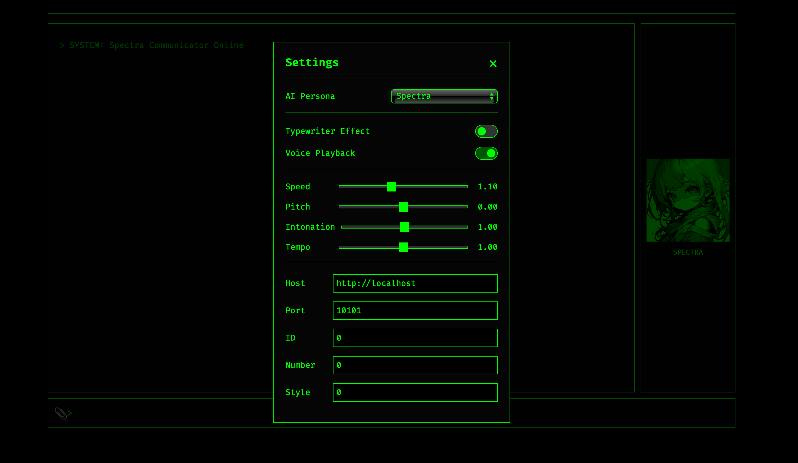

# Avatar UI Core

A classic terminal-style UI core. Provides an extensible project foundation from chat UI to CLI integration.


[](https://github.com/psf/black)



## Features

- **Terminal UI** - Classic green-on-black terminal interface
- **AI Avatar** - Pixel art avatar with synchronized speech animation (configurable per persona)
- **Typewriter Effect** - Real-time character-by-character display animation (toggle ON/OFF)
- **Sound Effects** - Typing sound generation using Web Audio API
- **Voice Synthesis** - AI responses can be played as audio (toggle ON/OFF, vsay options adjustable)
- **Image Upload** - Attach images to chat and send to AI (drag & drop supported)
- **AI Persona Management** - Switch between multiple AI personas (avatar, prompt, voice settings saved per persona)
- **Persistent Settings** - Last used persona and UI settings saved in browser
- **Image Input Support** (Ollama only) - Capable of reading images for multimodal models

## Basic Operations

1. **Send Message**: Type text in the input field at the bottom and press Enter
2. **Conversation History**: View automatically scrolling conversation history
3. **Avatar**: Avatar animates while AI is responding
4. **Settings**: Click the avatar image to open the settings modal and change various settings.

## Quick Start

### Requirements

- Python 3.8 or higher
- Google AI Studio API Key ([Get it here](https://aistudio.google.com/app/apikey))
- **vsay**: Used for voice synthesis. Place it as `./bin/vsay` and grant execute permissions. You can install it from [here](https://github.com/Dotinkasra/vsay).
- **AivisSpeach** or **VOICEVOX** engine (if using voice synthesis)

### Installation

#### 1. Get the Project

```bash
# Clone repository (or download and extract ZIP)
git clone https://github.com/yourusername/avatar-ui-core.git
cd avatar-ui-core
```

#### 2. Create Python Virtual Environment

Using a virtual environment keeps your system Python clean.

```bash
# Create virtual environment
python -m venv venv

# Activate virtual environment
# Linux/Mac:
source venv/bin/activate
# Windows (Command Prompt):
vvenv\Scripts\activate
# Windows (PowerShell):
vvenv\Scripts\Activate.ps1
```

When activated, you'll see `(venv)` in your terminal prompt.

#### 3. Install Required Packages

```bash
# Install packages from requirements.txt
pip install -r requirements.txt
```

### Configuration

#### 1. Prepare Environment File

```bash
# Copy template to create .env file
cp .env.example .env
# Windows: copy .env.example .env
```

#### 2. Setting Environment Variables
Open `.env` file in a text editor and configure required settings

##### Common Configuration
**To make the server accessible externally, adjust the following settings**

```bash
# Host address
SERVER_HOST=0.0.0.0
# Debug mode
DEBUG_MODE=False
```

##### AI Provider Selection
Select `gemini` or `ollama` for `AI_PROVIDER`.

###### When using Google Gemini

```bash
AI_PROVIDER=gemini
GEMINI_API_KEY=paste_your_api_key_here
MODEL_NAME=gemini-1.5-flash-latest  # or gemini-1.5-pro-latest etc.
```

###### When using Ollama

```bash
AI_PROVIDER=ollama
OLLAMA_HOST=the_IP_address_of_the_Ollama_server_machine (e.g., http://localhost:11434 or http://host.docker.internal:11434 for Docker)
MODEL_NAME=llama3:latest # other installed model names
```

#### 3. AI Persona Settings

AI personality, avatar images, and voice settings are managed in JSON files within the `prompt_settings/` directory.

- `prompt_settings/Spectra.json`: Default persona settings

Create additional JSON files in this directory to manage multiple personas.

These files can be edited directly or changed via the application's UI by opening the settings modal.

**Important**: `.env` file contains sensitive information. Never commit it to Git.

### Launch

```bash
# Start the application
python app.py
```

On successful launch, you'll see:
```
 * Running on http://127.0.0.1:5000
```

Access the application at `http://localhost:5000` in your browser.

## Project Structure

```
avatar-ui-core/
├── app.py                  # Flask application
├── settings.py             # Configuration management
├── requirements.txt        # Python dependencies
├── .env.example           # Environment template
├── prompt_settings/       # AI Persona settings files
│   ├── Spectra.json
├── static/
│   ├── css/
│   │   └── style.css      # UI styles
│   ├── js/
│   │   ├── app.js         # Main entry point
│   │   ├── chat.js        # Chat functionality
│   │   ├── animation.js   # Animation control
│   │   ├── sound.js       # Sound effects
│   │   └── settings.js    # Frontend configuration
│   ├── images/
│   │   ├── idle.png       # Avatar (idle)
│   │   └── talk.png       # Avatar (talking)
│   └── audio/             # Generated audio files
└── templates/
    └── index.html         # HTML template
```

**Note**: The `docs/` folder contains development notes and assets, and does not affect application functionality.

## Customization

Most settings can now be changed directly from the UI.



### 1. AI Persona Customization

Edit JSON files in the `prompt_settings/` directory or use the application's UI (click the avatar image to open the settings modal) to select an "AI Persona" and adjust various settings.

- `avatarName`: AI assistant's name
- `avatarFullName`: AI assistant's full name (displayed at the top of the chat)
- `systemInstruction`: Prompt defining AI's personality and response style
- `avatarImageIdle`: Filename for idle avatar image (relative path from `static/images/`)
- `avatarImageTalk`: Filename for talking avatar image (relative path from `static/images/`)
- `vsayOptions`: Options for the voice synthesis command `vsay` (e.g., Speed, Pitch)

```json
//prompt_settings/persona-name.json
{
  "avatarName": "Persona Name",
  "avatarFullName": "Message displayed at the top of the chat",
  "systemInstruction": "System prompt",
  "avatarImageIdle": "idle_image_name.png",
  "avatarImageTalk": "talking_image_name.png",
  "vsayOptions": {
    "host": "http://localhost", // Host address where AivisSpeach or VOICEVOX engine is running
    "port": 10101, // Port number
    "id": 0, // Style ID (not needed if "number" and "style" are set)
    "number": 0, // Speaker ID (not needed if "id" is set)
    "style": 0, // Style ID as displayed by `vsay ls` (not needed if "id" is set)
    "intonation": 1.0, 
    "pitch": 0.0,
    "speed": 1.1,
    "tempo": 1.0
  }
}
```

### 2. Typewriter Effect ON/OFF

Toggle "Typewriter Effect" ON/OFF from the application's UI (click the avatar image to open the settings modal).

### 3. Voice Playback ON/OFF

Toggle "Voice Playback" ON/OFF from the application's UI (click the avatar image to open the settings modal).

### 4. vsay Option Adjustment

Adjust `vsay` command options like "Speed" and "Pitch" using sliders and text inputs from the application's UI (click the avatar image to open the settings modal). Settings are saved to the current persona.

### 5. Other Settings

Edit the following items in `settings.py`:

- `TYPEWRITER_DELAY_MS`: Typewriter effect speed (milliseconds, smaller = faster)
- `MOUTH_ANIMATION_INTERVAL_MS`: Mouth animation interval (milliseconds)
- `BEEP_FREQUENCY_HZ`: Beep sound frequency (Hz)
- `BEEP_VOLUME`: Beep sound volume (0.0-1.0)
- `BEEP_DURATION_MS`: Beep sound duration (milliseconds)
- `BEEP_VOLUME_END`: Beep sound end volume

**Note**: Application restart is required after changing `settings.py`.

## Environment Variables

| Variable | Description | Default | Required |
|----------|-------------|---------|----------|
| `AI_PROVIDER` | AI provider to use (`gemini` or `ollama`) | `gemini` | ✅ |
| `GEMINI_API_KEY` | Google Gemini API Key | - | ✅ (if `AI_PROVIDER` is `gemini`) |
| `OLLAMA_HOST` | Ollama server host URL | - | ✅ (if `AI_PROVIDER` is `ollama`) | 
| `MODEL_NAME` | AI model name to use | `gemini-1.5-flash-latest` or `llama3:latest` | ✅ |
| `SERVER_HOST` | Server address | `127.0.0.1` | |
| `SERVER_PORT` | Server port number | `5000` | |
| `DEBUG_MODE` | Enable debug mode | `True` | |
| `FLASK_SECRET_KEY` | Flask session secret key | Randomly generated | |

**Note**: AI-related settings like `AVATAR_NAME` and `SYSTEM_INSTRUCTION` are now managed in persona JSON files within the `prompt_settings/` directory.

## Tech Stack

### Backend
- **Flask 3.0.0** - Web application framework
- **google-generativeai 0.8.3** - Gemini API integration
- **ollama** - Ollama local AI model integration
- **python-dotenv 1.0.0** - Environment variable management

### Frontend
- **ES6 Modules** - Modular JavaScript
- **Web Audio API** - Native browser sound generation
- **CSS3** - Modern styling
- **Fira Code** - Programming font

## ⚠️ Important Notes

- This project is provided as a naked UI foundation, with default implementation designed for single-user use.
- Sensitive information such as API keys is stored in `.env` and used only on the server side.
- **vsay command execution permission**: The `vsay` command requires execute permissions. Grant permissions with `chmod +x ./bin/vsay`.
- **Generated audio files**: Temporary audio files are generated in the `static/audio/` directory. These files are automatically deleted during the next chat request or when the application starts.
- Suitable for personal use and learning purposes as-is, but when deploying for public access:
  - User-specific configuration storage required
  - Authentication mechanisms must be added

## License

MIT License - See [LICENSE](LICENSE) file for details

## Credits

Developed by Sito Sikino

### Technologies Used
- Google Gemini API
- Flask Framework  
- Fira Code Font

---

**Note**: This project is created for entertainment and creative purposes. Please implement appropriate security measures when using in production environments.
